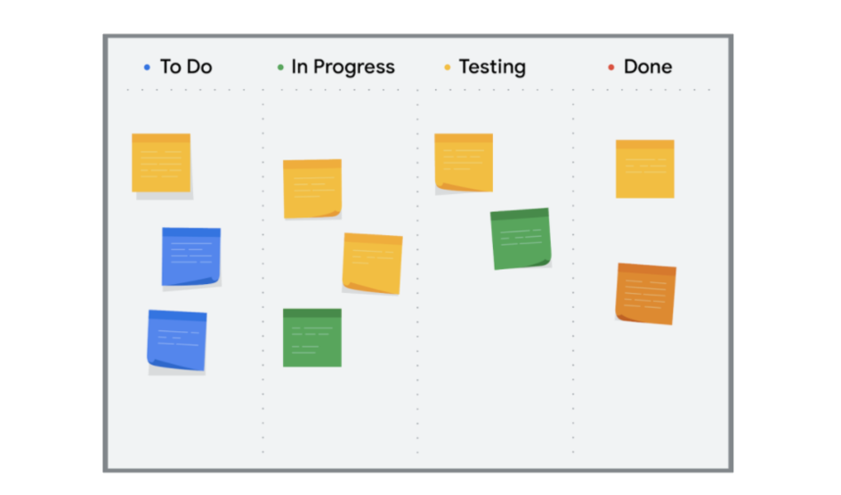

# Foundations of Project Management
[Link](https://www.coursera.org/learn/project-management-foundations) on Coursera

  * [The project life cycle](#the-project-life-cycle)
    + [Initiate the project](#initiate-the-project)
    + [Make a plan](#make-a-plan)
    + [Execute the project](#execute-the-project)
    + [Close the project](#close-the-project)
  * [Project management approaches](#project-management-approaches)
  * [Organizational structures](#organizational-structures)
    + [Project Management Office](#project-management-office)
  * [Governance](#governance)
    + [Corporate governance](#corporate-governance)
    + [Project governance](#project-governance)
  * [Initiate phase](#initiate-phase)
    + [6 major factors](#6-major-factors)
    + [Questions for a cost-benefit analysis](#questions-for-a-cost-benefit-analysis)
    + [OKR](#okr)
  * [Glossary](#glossary)

## The project life cycle

### Initiate the project

In this phase, ask questions to help set the foundation for the project, such as:

* Who are the stakeholders?
* What are the client’s or customer’s goals?
* What is the purpose and mission of the project?
* What are the measurable objectives for the team?  
* What is the project trying to improve?     
* When does this project need to be completed?   
* What skills and resources will the project require? 
* What will the project cost? What are the benefits?

### Make a plan

In this phase, make a plan to get your project from start to finish.

Create a detailed project plan. What are the major milestones? What tasks or deliverables make up each milestone?  
Build out the schedule so you can properly manage the resources, budget, materials, and timeline. Here, you will create an itemized budget.

### Execute the project

In this phase, put all of your hard work from the first two phases into action.

* Monitor your project team as they complete project tasks. 
* Break down any barriers that would slow or stop the team from completing tasks. 
* Help keep the team aware of schedule and deliverable expectations.
* Address weaknesses in your process or examine places where your team may need additional training to meet the project’s goals.
* Adapt to changes in the project as they arise.

### Close the project

In this phase, close out the project.

* Identify that your team has completed all of the requested outcomes.   
* Release your team so they can support other projects within the company.  
* Take time with your team to celebrate your successes!   
* Pass off all remaining deliverables and get stakeholder approval.  
* Document the lessons you and your team learned during the project.  
* Reflect on ways to improve in the future.

## Project management approaches

**Waterfall** is a traditional methodology in which tasks and phases are completed in a linear, sequential manner, and each stage of the project must be completed before the next begins. The project manager is responsible for prioritizing and assigning tasks to team members. In Waterfall, the criteria used to measure quality is clearly defined at the beginning of the project.

**Agile** involves short phases of collaborative, iterative work with frequent testing and regularly-implemented improvements. Some phases and tasks happen at the same time as others. In Agile projects, teams share responsibility for managing their own work. Scrum and Kanban are examples of Agile frameworks, which are specific development approaches based on the Agile philosophy.

**Scrum** is an Agile framework that focuses on developing, delivering, and sustaining complex projects and products through collaboration, accountability, and an iterative process. Work is completed by small, cross-functional teams led by a Scrum Master and is divided into short Sprints with a set list of deliverables.

**Kanban** is both an Agile approach and a tool that provides visual feedback about the status of the work in progress through the use of Kanban boards or charts. With Kanban, project managers use sticky notes or note cards on a physical or digital Kanban board to represent the team’s tasks with categories like “To do,” “In progress,” and “Done.”

**Lean** uses the 5S quality tool to eliminate eight areas of waste, save money, improve quality, and streamline processes. The main principle in Lean methodology is the removal of waste within an operation. By optimizing process steps and eliminating waste, only value is added at each phase of production. Lean uses a Kanban scheduling system to manage production. Implement Lean project management when you want to use limited resources, reduce waste, and streamline processes to gain maximum benefits.

  
 > 5S

  
  **5S helps you boost performance.**
  1. Sort: Remove all items not needed for current production operations and leave only the bare essentials. 
  2. Set in order: Arrange needed items so that they are easy to use. Label items so that anyone can find them or put them away. 
  3. Shine: Keep everything in the correct place. Clean your workspace every day.
  4. Standardize: Perform the process in the same way every time. 
  5. Sustain: Make a habit of maintaining correct procedures and instill this discipline in your team.

**Six Sigma** involves reducing variations by ensuring that quality processes are followed every time. The Six Sigma method follows a process-improvement approach called DMAIC, which stands for define, measure, analyze, improve, and control. The term “Six Sigma” originates from statistics and generally means that items or processes should have 99.9996% quality.

  
 > Seven key principles of Six Sigma

  
  1. Always focus on the customer.
  2. Identify and understand how the work gets done. Understand how work really happens.
  3. Make your processes flow smoothly.
  4. Reduce waste and concentrate on value.
  5. Stop defects by removing variation.
  6. Involve and collaborate with your team.
  7. Approach improvement activity in a systematic way.
  
  The largest difference between Lean and Six Sigma is that Lean streamlines processes while Six Sigma reduces variation in products by building in quality from the beginning and inspecting products to ensure quality standards are met.

**Lean Six Sigma** is a combination of Lean and Six Sigma approaches. It is often used in projects that aim to save money, improve quality, and move through processes quickly. Lean Six Sigma is also ideal for solving complex or high-risk problems. The 5S quality tool, the DMAIC process, and the use of Kanban boards are all components of this approach. 

## Organizational structures

**Classic structure.** The Classic organizational structure is a top-down hierarchy system, where a Chief Executive Officer (CEO) has direct authority over several department managers. The department manager has direct authority over several other sections of employees. This system requires communication both up and down the ladder. In a Classic structure, authority comes from the top and filters to the bottom. Classic organizations are also referred to as functional organizations because the organization is divided into departments based on function. 

**Matrix structure.** The Matrix structure differs from the Classic structure in that the employees have two or more managers. In Matrix structures, you still have people above you, but you also have people in adjacent departments with whom you will need to communicate on your work progress. Functional areas tend to cross paths more frequently, and depending on the nature of the work, the responsible manager for each area has the most authority. Within Matrix organizations, some project managers may have the same level of authority as the functional managers and operate more directly.

### Project Management Office
A **Project Management Office**, or **PMO**, is a group within an organization that defines, sets, and helps maintain project management standards and processes throughout that organization. PMOs support their organizations in managing large numbers of projects and help keep all employees working in the same direction towards the organization’s goals. 

**Key purposes of a PMO**
* Strategic planning and governance
* Implementing project management best practices
* Establishing common project culture
* Resource management
* Creating project documentation, archives, and tools

## Governance
**Governance** in business is the management framework within which decisions are made and accountability and responsibility are determined. In simple terms, governance is understanding who is in charge.

### Corporate governance
**Corporate governance** - set of standards and practices that direct and control organization's actions. Corporate governance affects every part of an organization, including action plans, internal and external controls, and performance measurements.

### Project governance
**Project governance** is the framework for how project decisions are made. Project governance helps keep projects running smoothly, on time, and within budget. It tells you what activities an organization does and who is responsible for those activities. Project governance covers policies, regulations, functions, processes, procedures, and responsibilities. 

## Initiate phase

### 6 major factors
1. Goals
2. Scope
3. Deliverables
4. Success criteria
5. Stakeholders
6. Resources

### Questions for a cost-benefit analysis
**To determine the benefits of a project:**
* What value will this project create? 
* How much money could this project save our organization? 
* How much money will it bring in from existing customers?
* How much time will it save? 
* How will it improve the customer experience?

**To determine the costs of a project:**
* How much time will people have to spend on this project?
* What are the one-time costs?
* Are there any ongoing costs?
* What about long-term costs? 

**To determine intangible benefits:**
* **Customer satisfaction.** Will the project increase customer retention, causing them to spend more on the company’s products or services? 
* **Employee satisfaction.** Is the project likely to improve employee morale, reducing turnover? 
* **Employee productivity.** Will the project reduce employee’s overtime hours, saving the company money?
* **Brand perception.** Is the project likely to improve the company’s brand perception and recognition, attracting more customers or providing a competitive advantage?

**To determine intangible costs:**
* Might the project put customer retention, employee satisfaction, or brand perception at risk?

### OKR
**Objectives and key results (OKR)** - combines a goal and a metric to determine a measurable outcome. 
Best practices:
* Objectives should be motivational and inspiring and key results should be tactical and specific. The objective describes what you want to do and the key results describe how you’ll know you did it. 
* 2–-3  key results for each objective.

### Scope management best practices
* Define your project’s requirements
* Set a clear project schedule
* Determine what is out of scope. Make sure your stakeholders, customers, and project team understand when proposed changes are out of scope
* Provide alternatives
* Set up a change control process
* Learn how to say no
* Collect costs for out-of-scope work

### Project Management Triple Constraints
* Scope
* Time
* Costs

## Glossary

**Cross-functional team**: Team members who have different skill sets and may even work in different departments but are all working towards the successful completion of a project

**Organizational culture** refers to the values employees share and an organization’s values, mission, history, and more. In other words, organizational culture can be thought of as a company's personality.

**Change management** is the process of delivering your completed project and getting other people in the organization to adopt it. 
**Core concepts of change management:**
* Create a sense of ownership and urgency - customers should see why they should start using new project
* Figure out right combination of skills and personalities for people in your team
* Effective communication 

**Stakeholder**: People who are interested in and affected by the project’s completion and success

**Cost-benefit analysis** is the process of adding up the expected value of a project—the benefits—and comparing them to the dollar costs.
**Return on investment (ROI) = (G - C) / C**, G - the financial gains you expect from the project, and C - the upfront and ongoing costs of your investment in the project.

**Scope creep** is when a project’s work starts to grow beyond what was originally agreed upon during the initiation phase.

**Lounch** is delivering the final result of your project ot the client or user.

**Landing** is when project reaching the success point using success criteria established at the start of the project.

**Adoption** - how the customer uses and adopts a product orservice without any issues.

**Engagement** - how often ormeaningful customer interaction and participation is over time. 
